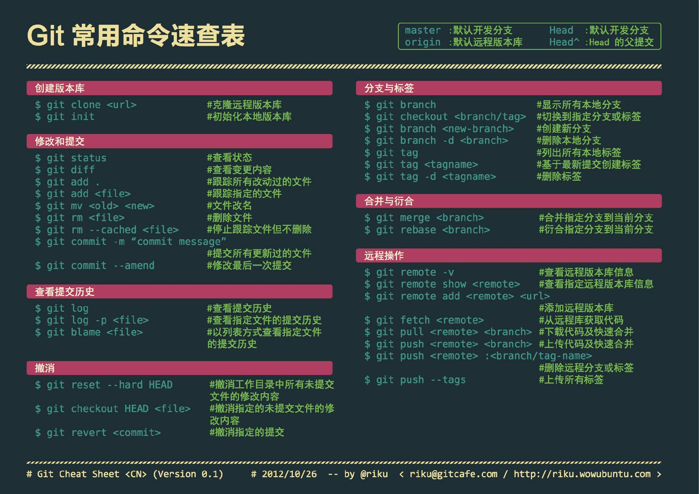

# Github-Basic-Operation

Git基本操作命令：

- 初次从本地提交代码到github仓库的整个流程：

```
git init
git add .
git commit -m "created:Project Init"
git remote add origin git@github.com:Healingl/Github-Basic-Operation.git
git push -u origin master
```

- 更新上传github代码

查看git仓库信息：

```
git remote -v
```

检查冲突及上传：

```
git pull
git add .
git commit -m "added: git commands"
git push -u origin master
```

- 克隆项目

```
git clone git@github.com:Healingl/Leetcode-Python-Algorithm.git
git add .
git commit -m "added: git commands"
git push -u origin master
```


- git常用命令

