# Github-Basic-Operation

## 1.Git基本操作命令

- 初次从本地提交代码到github仓库的整个流程：

```
git init
git add .
git commit -m "created:Project Init"
git remote add origin git@github.com:Healingl/Github-Basic-Operation.git
git push -u origin master
```

- 更新上传github代码

查看git仓库信息：

```
git remote -v
```

检查冲突及上传：

```
git pull
git add .
git commit -m "added: git commands"
git push -u origin master
```

- 克隆项目

```
git clone git@github.com:Healingl/Leetcode-Python-Algorithm.git
git add .
git commit -m "added: git commands"
git push -u origin master
```


- git常用命令


## 2.连接Github

首先在本地创建ssh key：

```
$ ssh-keygen -t rsa -C "605540375@qq.com"
```

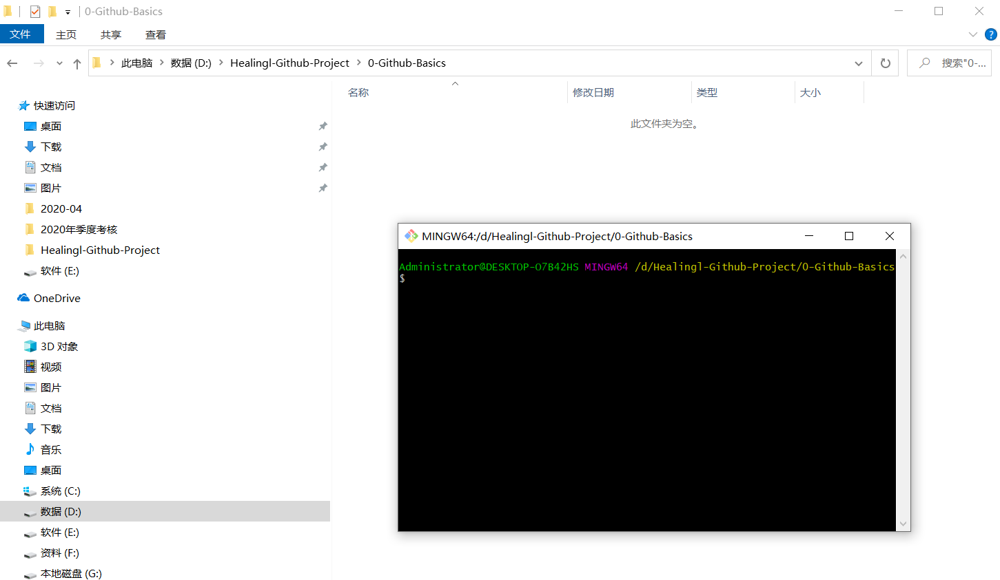

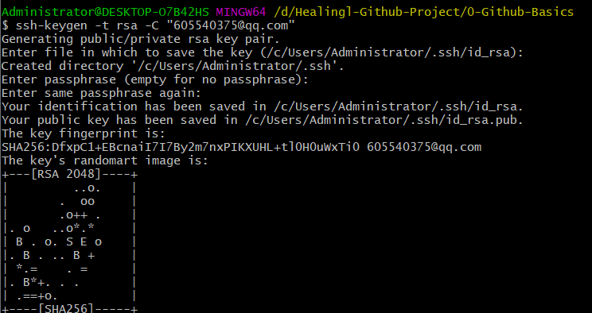

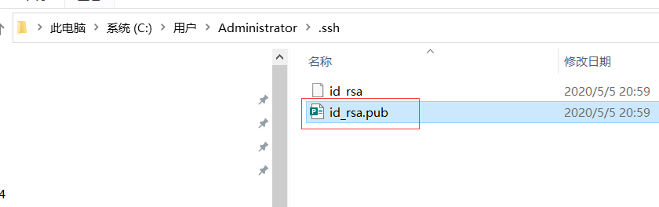


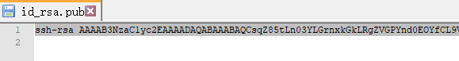


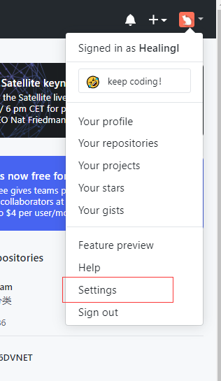

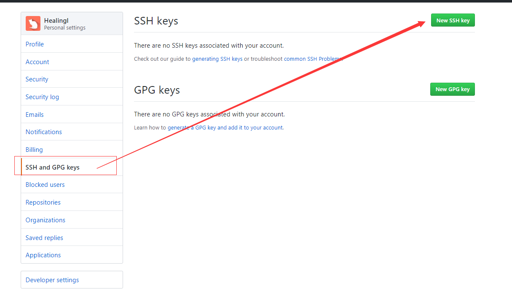

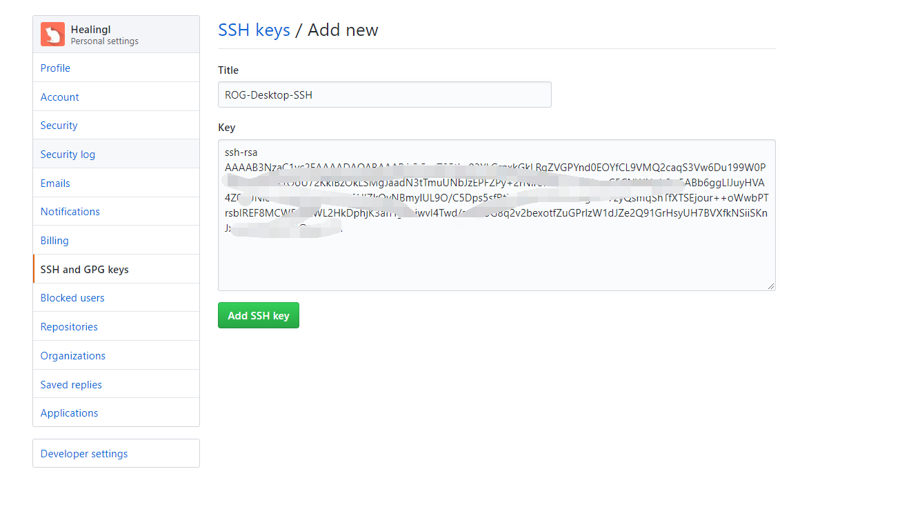


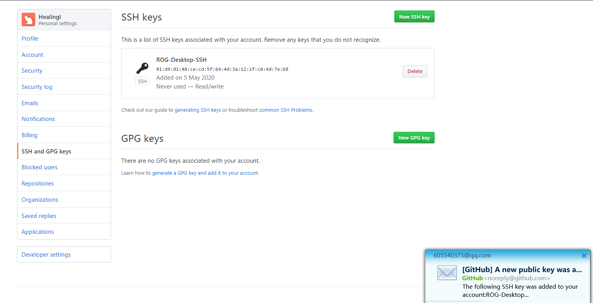


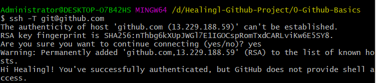


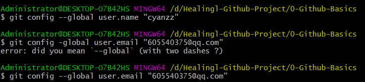


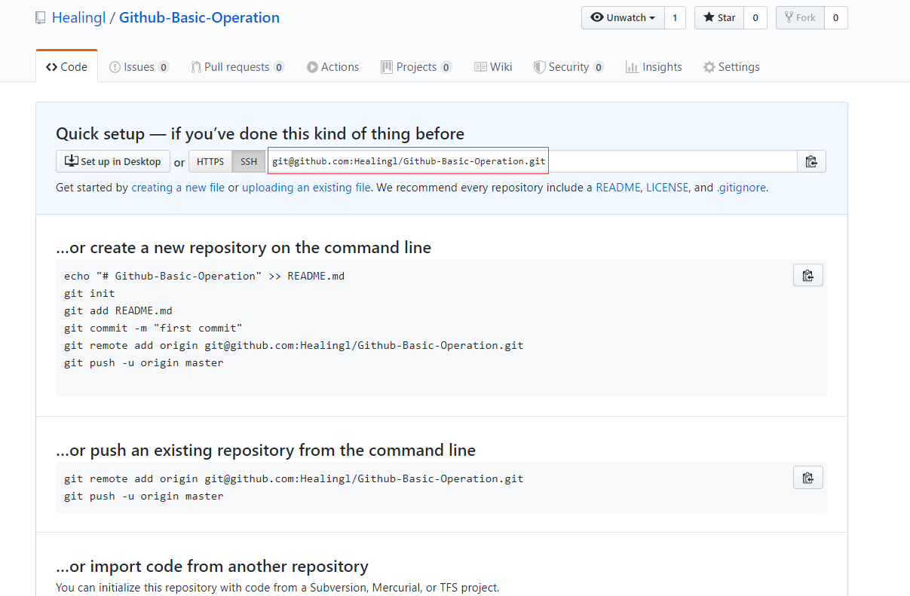


创建本地仓库：

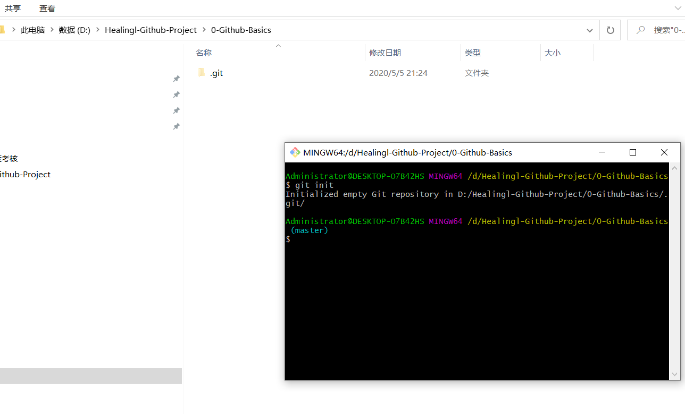


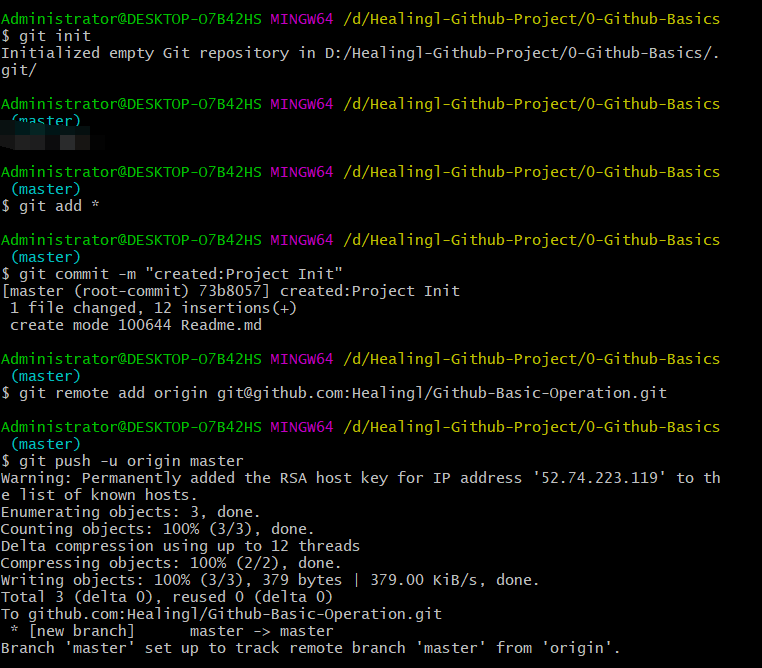


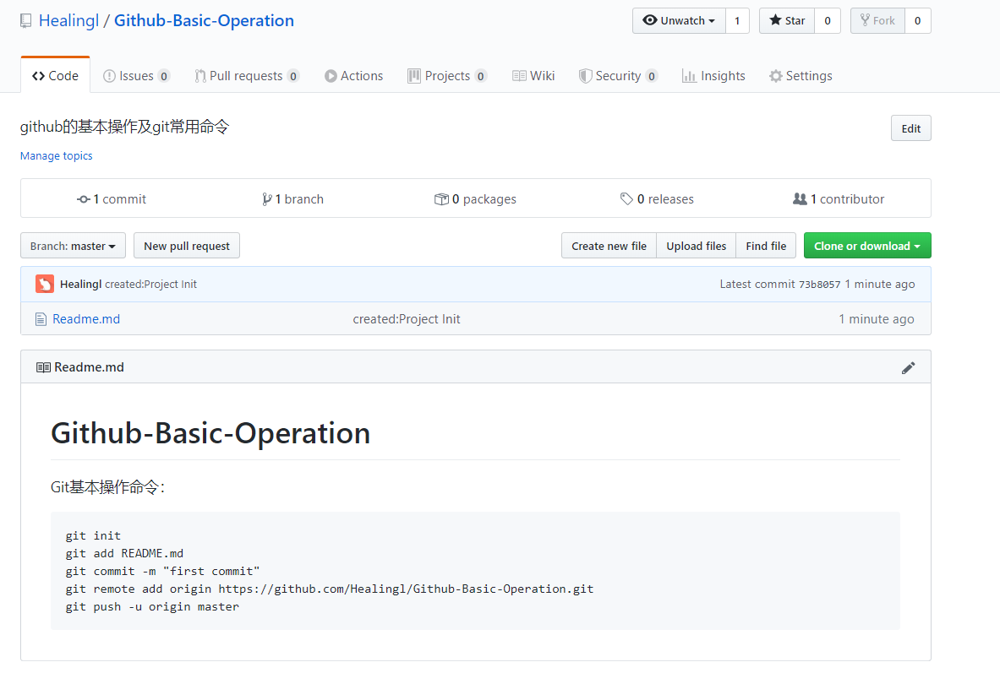


## 3.Pycharm预设模板

```
#!/usr/bin/env python
# -*- coding: utf-8 -*-

# # # # # # # # # # # # # # # # # # # # # # # # # # # # # # # # 
# @Project: ${PROJECT_NAME}
# @IDE: ${PRODUCT_NAME}
# @File: ${NAME}.py
# @Author: ZhuangYuZhou
# @E-mail: 605540375@qq.com
# @Time: ${DATE}
# @Desc: 
# # # # # # # # # # # # # # # # # # # # # # # # # # # # # # # # 
```

